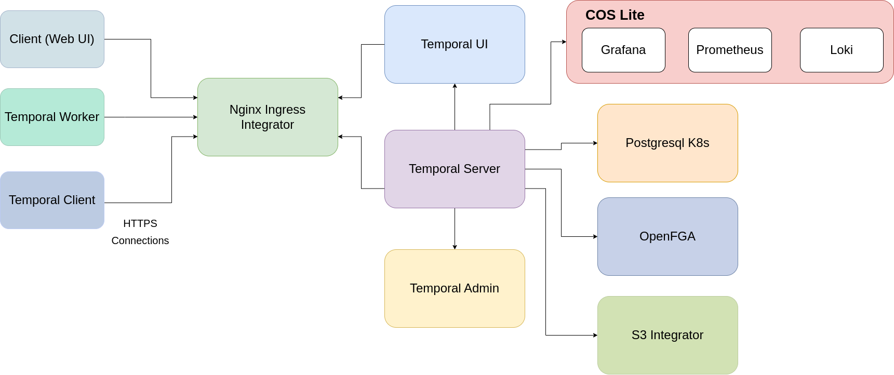

# Architecture

The Charmed Temporal ecosystem consists of a number of different charmed
operators related together. The diagram below shows a high-level illustration of
the different charms and their relations. The charmed components are as follows:

- **Temporal Server**: The
  [Temporal server](https://docs.temporal.io/clusters#temporal-server) is a
  group of four independently scalable services (frontend, history, matching and
  worker). It is reponsible for state management and task synchronization among
  other functionalities.

- Temporal Admin: The Temporal Admin Tools are a set of command-line utilities
  used to configure and support the Temporal server.

- Temporal UI: The Temporal Web UI is a user interface used to interact with and
  monitor Temporal workflows and activities.

- PostgreSQL K8s: For Temporal
  [persistance](https://docs.temporal.io/clusters#persistence) and
  [visibility](https://docs.temporal.io/clusters#visibility), we use the
  [PostgreSQL K8s](https://charmhub.io/postgresql-k8s) charmed operator. The
  PostgreSQL K8s charm can be deployed and related to the Temporal server.

- Nginx Ingress Integrator: The Charmed Temporal K8s operator exposes its
  service ports using the
  [Nginx Ingress Integrator](https://charmhub.io/nginx-ingress-integrator)
  operator.

- Temporal Worker: The [Temporal Worker](https://docs.temporal.io/workers) is
  the entity which listens and polls on specific task queue, and executes code
  in response to the task.

